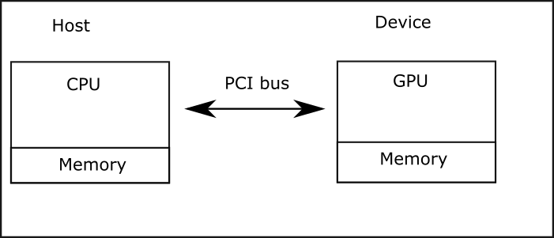
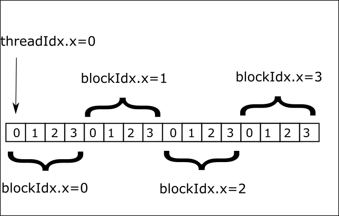
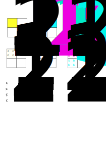

# CUDA Part 1


CUDA is a parallel programming platform created by NVIDIA. Obviously it works on NVIDIA GPUs.
The massive number of cores on the GPU allows us to create a massive number of concurrent threads. 
Unlike a CPU which is designed to run a relatively low number of threads (dozens), a GPU is designed to run thousands of threads. Even though a single thread performance on CPU is better
than on the GPU, the fact that one can run thousands of threads overcomes the slow performance per thread.


A CUDA device contains an array of _streaming multiprocessors_ (SM).In the CUDA programming model, threads are organized into __thread blocks__. Each __thread blocks__ runs independently on a different SM.


## Example 1

Our first CUDA example doesn't do much but introduces some important syntax
```cpp
__global__ mykernel(){

}
int main(){
    mykernel<<<1,1>>>();
    return 0;
}
```

This is a simple C++ program with the addition of two constructs
1. __global__ keyword. This means the function is called from the host and runs on the device.
1. <<<1,1>>> is a call from host code to device code. Also called a _kernel launch_.

The parameters 1,1 refer to the number of blocks and the number of threads per block, in this case a single thread
in a single block.

## Example 2

This simple example illustrates the typical process for computing with a GPU.

### Processing flow

In what follows the host refers to the CPU/RAM and the device to the GPU. The figure below
shows the processing flow. 

1. Data is transferred from host memory to device memory
1. Computation is done on the device via _kernel_ launch (see later)
1. Data is transferred back from device memory to host memory





```cpp
#include <cuda_runtime.h>
#include <device_launch_parameters.h>
#include <iostream>
__global__ void kernel(int *x,int *y,int *z){
    *z=*x+*y;
}
int main(){
    int a=1,b=2,c=0; //host variables
    int *d_a,*d_b,*d_c;//will hold device addresses
    // allocate memory for one integer and store the
     // address in d_a 
    cudaMalloc(&d_a,sizeof(int));
    cudaMalloc(&d_b,sizeof(int));
    cudaMalloc(&d_c,sizeof(int));
    // copy the value of a and b
    // TO device FROM host
    cudaMemcpy(d_a,&a,sizeof(int),cudaMemcpyHostToDevice);
    cudaMemcpy(d_b,&b,sizeof(int),cudaMemcpyHostToDevice);
    kernel<<<1,1>>>(d_a,d_b,d_c);
    // copy the result TO host FROM device
    cudaMemcpy(&c,d_c,sizeof(int),cudaMemcpyDeviceToHost);
    cudaDeviceSynchronize();
    
std::cout<<"value of c is "<<c<<"\n";
    
}
```

## Example 3

This is the first example where we use parallelism, computing the sum of two arrays. The computation is performed where each thread computes the sum of two elements. To accomplish that we map the thread id to the array index. In this example we use a single, linear, block therefore the thread id is equal to the builtin variable threadIdx.x

```cpp
#include <iostream>
#include <cuda_runtime.h>
#include <device_launch_parameters.h>
__global__ void kernel(float* a, float* b, float* c) {
	int id = threadIdx.x;
	c[id] = a[id] + b[id];
}

int main() {
	int N = 1024;
	float* a, * b, * c;
	float* da, * db, * dc;
  /* allocate memory on host */
	a = (float*)malloc(N * sizeof(float));
	b = (float*)malloc(N * sizeof(float));
	c = (float*)malloc(N * sizeof(float));
  /* allocate memory on device */
	cudaMalloc(&da, N * sizeof(float));
	cudaMalloc(&db, N * sizeof(float));
	cudaMalloc(&dc, N * sizeof(float));
  /* initialize the arrays a and b */
	for (int i = 0; i < N; ++i) {
		a[i] = i;
		b[i] = 2 * i;
	}
  /* copy arrays a and b to device */
	cudaMemcpy(da, a, N * sizeof(float), cudaMemcpyHostToDevice);
	cudaMemcpy(db, b, N * sizeof(float), cudaMemcpyHostToDevice);
/* launch kernel with one block of N threads */
	kernel << <1, N >> > (da, db, dc);
  /* copy result to host */
	cudaMemcpy(c, dc, N * sizeof(float), cudaMemcpyDeviceToHost);
  /* print the first 10 elements */
	for (int i = 0; i < 10; ++i)
		std::cout << c[i] << ' ';
	std::cout << std::endl;
	/* free memory on host and device */
	free(a);
	free(b);
	free(c);
	cudaFree(db);
	cudaFree(dc);
	cudaFree(da);

}

```


## Thread blocks

In CUDA the maximum number of threads in a block is 1024. What if in the previous example we would like to compute the sum of two vectors with size bigger than 1024? We use multiple blocks. We also need to consider the case when the number of total threads is larger than the array size. When using multiple blocks the thread id can be computed as follows(see figure) id=blockIdx.x*blockDim.x+threadIdx.x



We repeat the previous example by using multiple blocks. Note that since the number of threads
per block is fixed, the total number of threads might be bigger than the size of the arrays, hence the if condition.

```cpp
#include <iostream>
#include <cuda_runtime.h>
#include <device_launch_parameters.h>
__global__ void kernel(float* a, float* b, float* c,int n) {
	int id = blockIdx.x*blockDim.x+threadIdx.x;
  if(id<n)
	  c[id] = a[id] + b[id];
}

int main() {
	int N = 2048;
	float* a, * b, * c;
	float* da, * db, * dc;
  /* allocate memory on host */
	a = (float*)malloc(N * sizeof(float));
	b = (float*)malloc(N * sizeof(float));
	c = (float*)malloc(N * sizeof(float));
  /* allocate memory on device */
	cudaMalloc(&da, N * sizeof(float));
	cudaMalloc(&db, N * sizeof(float));
	cudaMalloc(&dc, N * sizeof(float));
  /* initialize the arrays a and b */
	for (int i = 0; i < N; ++i) {
		a[i] = i;
		b[i] = 2 * i;
	}
  /* copy arrays a and b to device */
	cudaMemcpy(da, a, N * sizeof(float), cudaMemcpyHostToDevice);
	cudaMemcpy(db, b, N * sizeof(float), cudaMemcpyHostToDevice);
/* divide the load into num_blocks */
  int num_blocks=N/1024;
	kernel << <num_blocks, 1024>> > (da, db, dc,N);
  /* copy result to host */
	cudaMemcpy(c, dc, N * sizeof(float), cudaMemcpyDeviceToHost);
  /* print the last 10 elements */
	for (int i = 0; i < 10; ++i)
		std::cout << c[2047-i] << ' ';
	std::cout << std::endl;
	/* free memory on host and device */
	free(a);
	free(b);
	free(c);
	cudaFree(db);
	cudaFree(dc);
	cudaFree(da);

}

```

## Matrix Multiplication





