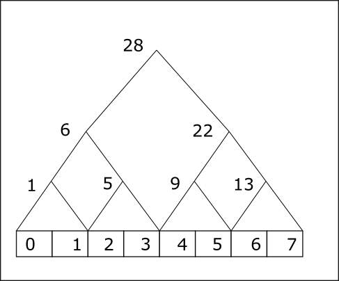
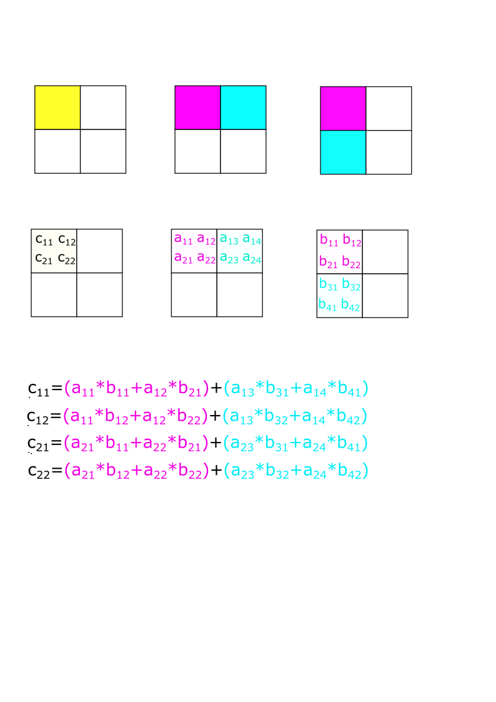

---
header-includes:
  - \usepackage{algorithm2e}
---

# CUDA Part 1


CUDA is a parallel programming platform created by NVIDIA. Obviously it works on NVIDIA GPUs.
The massive number of cores on the GPU allows us to create a massive number of concurrent threads. 
Unlike a CPU which is designed to run a relatively low number of threads (dozens), a GPU is designed to run thousands of threads. Even though a single thread performance on CPU is better
than on the GPU, the fact that one can run thousands of threads overcomes the slow performance per thread.

## First Example

A first example of CUDA code is shown below. Three things to note. First the keyword ```__global__``` means that this function is called from CPU and runs on the GPU. The second are the chevron symbols ```<<<1,1>>>``` in the call to ```GPUFunction```. This is the **launch configuration** and ```GPUFunction``` is called a **kernel**. We refer to the  whole line as a  **kernel launch**.  We will have more to say about it later, but at this point it sufficient to say that we launch the kernel with one **block** containing one **thread**. The third is ```cudaDeviceSynchronize()```. This is needed because the **kernel launch** is asynchronous with respect to CPU code. This means that both run concurrently. If it is not included, the main function would exit without waiting for the GPU code to complete. To force the CPU to wait for the GPU we need to add ```cudaDeviceSynchronize()```. Lastly, note that the C++  `iostream` is not implemented on 
the GPU that is why we resort to the C-style `printf`. Console input/output is not really needed on the GPU; `printf` 
is just used for debugging. 


<script src="https://gist.github.com/hikmatfarhat-ndu/373618ab3b58da7791a729d00f9af270.js?file=example1.cu"></script>


The extension for CUDA code is ```.cu``` and it is compiled using the NVIDIA C++ compiler ```nvcc```. The compiler will process CUDA extension to C++ and hands off the rest to the C++ compiler native to your platform, e.g. g++ on Linux and cl.exe on Windows. On Linux ( Google colab) and WSL2, compiling the code is simple. Just type (assuming the code is saved in a file called ```simple.cu```)

```nvcc simple.cu -o simple```

On Windows it is a bit more complicated. Refer to the Windows section at the end of this document.

#### **NOTE for free Google colab**: 
Most of the time the free version of colab gives you a Tesla K80 (Kepler) which is
 _compute capability_ 3.7 (see later) but the newest CUDA toolkit compiles for 5.2 by default. This means the default compilation will not work. Just replace it with ```nvcc -arch=compute_37 -code=sm_37```. We will discuss those points in details later.


## Launch Configuration

The launch configuration specifies how many **threads** should execute the kernel. The syntax  is:

`<<< NUMBER_OF_BLOCKS, NUMBER_OF_THREADS_PER_BLOCK>>>`
Obviously, all **blocks** will have the **same** number of threads.

**The kernel code is executed by every thread in every  block configured when the kernel is launched**.


In the example above, the following are true:
  - `GPUFunction<<<1, 1>>()`  a single thread in a single block will execute and thus there will be one "Hello from GPU" output.
  - `GPUFunction<<<1, 10>>()` 10 threads in a single block will execute and thus there will be 10 "Hello from GPU" .
  - `GPUFunction<<<10, 1>>()` 1 thread in each block will execute and thus there will be 10 "Hello from GPU"
  - `GPUFunction<<<6, 10>>()` 10 threads in each block will execute and thus there will be 60 "Hello from GPU"


## Thread hierarchy

Having all thread execute the same thing is not very useful. Usually we need different threads doing different computations.  To do that we need to distinguish between threads. CUDA organizes threads in blocks, and blocks are
grouped into a grid. Each thread in a block has an index starting at 0 and each block in the grid has an index 
starting at 0 as well.

When a kernel is launched it has access to special variables denoting the thread and block index. For now, we introduce
1-d indices.

1. `threadIdx.x` the index of a thread within a block
1. `blockIdx.x` the index of the block within the grid.

### Example

We will modify the previous example to launch kernel with a configuration of 2 blocks with 128 threads each. Only the last
thread in the second block will print "Hello".

<script src="https://gist.github.com/hikmatfarhat-ndu/373618ab3b58da7791a729d00f9af270.js?file=example2.cu"></script>

## High level view of GPU computing

This simple example illustrates the typical process for computing with a GPU.

### Processing flow

In what follows the host refers to the CPU/RAM and the device to the GPU. The figure below
shows the processing flow. 

1. Data is transferred from host memory to device memory
1. Computation is done on the device via _kernel_ launch (see later)
1. Data is transferred back from device memory to host memory


<script src="https://gist.github.com/hikmatfarhat-ndu/373618ab3b58da7791a729d00f9af270.js?file=example3.cu"></script>


## Parallelizing a for-loop

This is the first example where we use parallelism, computing the sum of two arrays. The computation is performed where each thread computes the sum of two elements. To accomplish that we map the thread id to the array index. In this example we use a single, linear, block therefore the thread id is equal to the builtin variable ```threadIdx.x```


<script src="https://gist.github.com/hikmatfarhat-ndu/373618ab3b58da7791a729d00f9af270.js?file=example4.cu"></script>

## Thread blocks

In CUDA the maximum number of threads in a block is 1024. What if in the previous example we would like to compute the sum of two vectors with size bigger than 1024? We use multiple blocks. We also need to consider the case when the number of total threads is larger than the array size. When using multiple blocks the thread id can be computed as follows(see figure) id=blockIdx.x*blockDim.x+threadIdx.x


We repeat the previous example by using multiple blocks. Note that since the number of threads
per block is fixed, the total number of threads might be bigger than the size of the arrays, hence the if condition.


<script src="https://gist.github.com/hikmatfarhat-ndu/373618ab3b58da7791a729d00f9af270.js?file=example5.cu"></script>

## Grid stride

One has to consider the case when, for various reasons, the number of elements is bigger than the number of threads. 
In this case some threads will do more than one computation. As a simple example, given an array of 1100 elements and 
a grid with 4 blocks with 256 threads each for a total of 1024 threads. Then (the first) 76 threads will have to do an
extra computation. This is done using a **Grid-stride** loop, as shown in the example below.


<script src="https://gist.github.com/hikmatfarhat-ndu/373618ab3b58da7791a729d00f9af270.js?file=example6.cu"></script>

A CUDA device contains an array of _streaming multiprocessors_ (SM).In the CUDA programming model, threads are organized into __thread blocks__. Each __thread blocks__ runs independently on a different SM.


**Note**: the assignment of blocks to SMs is static. Once the blocks are assigned to SMs they will not move even if some SMs finish running their blocks and  become idle. 
## NVIDIA CPUs Memory Hierarchy

The figure below shows the memory hierarchy for a typical NVIDIA GPU. Scalar variables __without qualifiers__ are  stored in registers, arrays in global/local memory. Variables preceded with ```__shared__``` and ```__constant__``` are stored in shared and constant memory respectively.

What concerns us in this section is that __shared__ memory, being on chip (typically 64KB), is much faster to access than DRAM.


The figure above gives a clear picture of the way blocks are handled, each block runs independently on an SM.
An important intrinsic primitive provided by CUDA is the ```__syncthread()``` call. It acts like a barrier for all threads in a block.

We will illustrate the above concepts with an implementation of the ```reduce``` operation. It is easier to visualize the reduce operation as a binary tree as in the example below.




The computation is done in multiple steps with the stride doubling for each step. Initially the stride is 1. Let ```a``` denote the array shown in the figure then the basic operations is 
```cpp
for(int stride=1;stride<n;stride*=2)
  if(i%2==0)
    a[i]+=a[i+stride]
```
If we map the index ```i``` to the thread id then each thread, for a given step, will do a single computation.
At the end of the process thread with id 0 will compute the final value.

```cpp

#define THREADS_PER_BLOCK 1024
__global__ void reduction1(int* da, int* db) {
	__shared__ int sdata[THREADS_PER_BLOCK];
	unsigned int tid = threadIdx.x;
	unsigned int i = blockIdx.x * blockDim.x + threadIdx.x;
	sdata[tid] = da[i];
	__syncthreads();
	// do reduction in shared mem
	
	for (unsigned int stride = 1; stride < blockDim.x; stride *= 2) {
		if (tid % (2 * stride) == 0) {
			sdata[tid] += sdata[tid + stride];
		}
		__syncthreads();
	}
	// write result for this block to global mem
	if (tid == 0) db[blockIdx.x] = sdata[0];
	
}

```
Note how the array ```sdata``` is declared, meaning it is stored in the fast shared memory of the block whereas ```da``` is stored in DRAM. Therefore, we transfer ```da``` to shared memory before the computation start. Each thread will copy one element from ```da``` to ```sa```. 

After that we have to make sure that all the transfers are completed before we start the computation, hence the first ```__syncthreads()```.

Similarly, since every step in the algorithm depends on the previous step we call ```__synchread()``` at the end of the each step.

In the above example, the size of shared memory was specified at compile time. We can specify it a run time by adding an extra parameter to the kernel launch call. 

```cpp
__global__ void reduction1(int* da, int* db) {
	extern __shared__ int sdata[];
	...
	...
}
int main(){
  ...
  reduction1<<<grid_size,block_size,shared_mem>>>(da,db);
  ...
}
```

Where ```shared_mem``` is the size in bytes.

### Warp scheduling

When a  block of threads is assigned to an SM it partitions them into 
warps and each warp gets scheduled by a warp scheduler for execution.
From the NVIDIA documentation 
```
A warp executes one common instruction at a time,
 so full efficiency is realized when all 
 32 threads of a warp agree on their execution path. 
 If threads of a warp diverge via a data-dependent conditional branch,
  the warp executes each branch path taken, disabling threads that are not on that path. 
```

Form the above we can conclude that there is a performance hit when consecutive threads executed different instructions. In our example, there is a branch based on the thread id
```cpp
if (tid % (2 * stride) == 0) {
			sdata[tid] += sdata[tid + stride];
		}
```
This means that for each warp one group of threads executes the sum whereas the second group skips it forcing the scheduler to have two divergent paths.

One way to fix this problem is to map the array indices to threads with __consecutive__ ids as shown below

```cpp

__global__ void reduction2(int* da, int* db) {
	__shared__ int sdata[THREADS_PER_BLOCK];
	unsigned int tid = threadIdx.x;
	unsigned int i = blockIdx.x * blockDim.x + threadIdx.x;
	sdata[tid] = da[i];
	__syncthreads();
	// do reduction in shared mem

	for (unsigned int stride = 1; stride < blockDim.x; stride *= 2) {
		int index = 2 * stride * tid;
		if (index<blockDim.x) {
			sdata[index] += sdata[index + stride];
		}
		__syncthreads();
	}
	// write result for this block to global mem
	if (tid == 0) db[blockIdx.x] = sdata[0];

}

```

## Matrix Multiplication

### Simple implementation

In this section we implement matrix multiplication in a straightforward way. For simplicity, we assume square matrices. We store the matrices in a row major representation. For an NxN matrix element a<sub>i</sub><sub>j</sub>=a\[i*N+j\]


To be able to handle more than 1024 entries we need to use multiple blocks. Since we are using two dimensional objects it is convenient to use the 2-d representation of thread indices provided by CUDA: threadIdx.x,threadIdx.y and blockIdx.x, blockIdx.y.

Each thread will compute __one__ element of the resulting multiplication as shown below.

```cpp
_global__ void mat_mult(float* da, float* db, float* dc, int width) {
    int row = blockIdx.y * blockDim.y + threadIdx.y;
    int col = blockIdx.x * blockDim.x + threadIdx.x;

    float result = 0;
    for (int k = 0; k < width; ++k) 
    {
        result += da[row * width + k] * db[k * width + col];
    }
    dc[row * width + col] = result;
}
```
We call ```mat_mult``` indirectly via ```time_kernel```.

```cpp
void time_kernel(float* da, float* db, float* dc, int width,
                         dim3 blocks_per_grid,dim3 threads_per_block) {
    cudaEvent_t kernel_start, kernel_end;
    cudaEventCreate(&kernel_start);
    cudaEventCreate(&kernel_end);
    /* warmup call*/
    mat_mult <<<blocks_per_grid, threads_per_block >> > (da, db, dc, width);
    float time = 0;
    float total = 0;
   
    for (int i = 0; i < 100; ++i) {
        cudaEventRecord(kernel_start);
        mat_mult << <blocks_per_grid, threads_per_block>> > (da, db, dc, width);
        cudaEventRecord(kernel_end);
        cudaEventSynchronize(kernel_end);
        cudaEventElapsedTime(&time, kernel_start, kernel_end);
        total += time;
    }
    /* average time in milliseconds */
    std::cout << "time " << total / 100 << '\n';

}

```


### Matrix Computation 2

To take advantage of shared memory we divide the matrices in tiles as shown in the figure below. Each block in the grid will compute one tile of matrix C (yellow). This is done by dividing the computation as a sequence of computations on the tiles in A and B. In the figure below the result (yellow) is the sum of two computations over tiles: read followed by blue. We need to load the corresponding tiles of A and B before the computation starts. The strategy in the example below is as follows
1. load the red tiles into shared memory
1. compute the product of reds
1. load the blue tiles into shared memory
1. add the computation of the product to the previous result

Loading of tiles is done in parallel. Each thread of the block will load one element of A and one element of B.

The above strategy looks promising but it has a flaw. A thread might start computation __before__ all threads have loaded their respective elements. Also, we need to make sure that subsequent loads do not start until all threads have finished computing with the current data.
We have seen this kind of synchronization primitive before, it is called a __barrier__. In CUDA, the ```arrive_and_wait()``` functionality of a barrier is performed with the ```__syncthreads()``` functions. Note that it synchronizes threads in the __same block__ only.



```cpp

#include <cuda_runtime.h>
#include <device_launch_parameters.h>
#include <iostream>
#include <algorithm>


#define BLOCK_SIZE 32
__global__ void mult(float* da, float* db, float* dc, int width) {

	int by= blockIdx.y;
	int bx = blockIdx.x;
	int ty = threadIdx.y;
	int tx = threadIdx.x;
	int row = by * BLOCK_SIZE + ty;
	int col = bx * BLOCK_SIZE + tx;
	__shared__ float sa[BLOCK_SIZE][BLOCK_SIZE];
	__shared__ float sb[BLOCK_SIZE][BLOCK_SIZE];
	float res = 0.0;
	int ntiles = width / BLOCK_SIZE;
	for (int b = 0; b < ntiles; ++b) {
		
		/* copy from memory to shared memory */
		sa[ty][tx] = da[row * width + b * BLOCK_SIZE + tx];
		sb[ty][tx] = db[(b * BLOCK_SIZE + ty) * width + col];
		
		__syncthreads();
		for (int k = 0; k < BLOCK_SIZE; ++k) {
			res += sa[ty][k] * sb[k][tx];
		}
		__syncthreads();
	}
	dc[row* width + col] = res;
}


int main() {
	cudaEvent_t kernel_start,kernel_end;
	cudaEventCreate(&kernel_start);
	cudaEventCreate(&kernel_end);


	float* a, * b, * c;
	float* da, * db, * dc;

	const int matrix_width = 1024;
	const int size = matrix_width * matrix_width;
	a = (float*)malloc(size * sizeof(float));
	b = (float*)malloc(size * sizeof(float));
	c = (float*)malloc(size * sizeof(float));
	for (int i = 0; i < size; ++i) {
		a[i] = 1;
		b[i] = 1;
	}
	cudaMalloc(&da, size * sizeof(float));
	cudaMalloc(&db, size * sizeof(float));
	cudaMalloc(&dc, size * sizeof(float));
	cudaMemcpy(da, a, size * sizeof(float), cudaMemcpyHostToDevice);
	cudaMemcpy(db, b, size * sizeof(float), cudaMemcpyHostToDevice);
	dim3 blockSize(BLOCK_SIZE, BLOCK_SIZE);
	dim3 gridSize(matrix_width/ BLOCK_SIZE, matrix_width / BLOCK_SIZE);
	mult << <gridSize, blockSize >> > (da, db, dc, matrix_width);
	float time = 0;
	float total = 0;

	for (int i = 0; i < 500; ++i) {
		cudaEventRecord(kernel_start,0);
		mult << <gridSize, blockSize >> > (da, db, dc, matrix_width);
		cudaEventRecord(kernel_end,0);
		cudaEventSynchronize(kernel_end);
		cudaEventElapsedTime(&time, kernel_start, kernel_end);
		total += time;
	}
	std::cout << "average time " << total/500 << '\n';
	cudaMemcpy(c, dc, size * sizeof(float), cudaMemcpyDeviceToHost);
	/*for (int i = 0; i < 64; i++)
		std::cout << c[i] << ' ';*/
	std::cout << std::endl;
	cudaFree(da);
	cudaFree(db);
	cudaFree(dc);
	free(a);
	free(b);
	free(c);

}

```