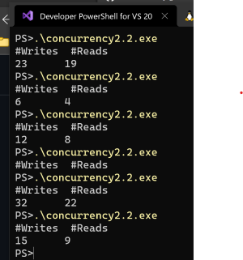

#    Sharing data between threads
  
1. First note that if the data shared between threads is never modified then we don't have a problem at all.
1.  The problems start to occur when one or more threads modifies the shared data.
  
---
  
##    Motivating Example
  
1. In the code below we define two functions: ```void add(int &)``` and ```void sub(int &)``` that increment/decrement the passed parameter by 1.

1. We create 4 threads: 2 that increment/decrement a variable ```x``` and the other 2 do the same for ```y```.
1. Since, for each variable, the number of increments is the same as decrements, we expect that, if we initialize to 0, that the final result is also 0. 
1. As you can see by running the code this is not the case.
1.  __Note__ the large number of iterations we are doing in ```add``` and ```sub```. 
1. If we did a single operations we won't catch the problem  because in that case the calling thread would finish execution before the system switches to another thread.
  

---

### Code 

```cpp

#define NUM_ITERATIONS 100000
#define NUM_TRIALS 6
void add(int& val) {
    for (int i = 0; i < NUM_ITERATIONS; ++i) 
        ++val;
}
void sub(int& val) {
    for (int i = 0; i < NUM_ITERATIONS; ++i)
        --val;
}
int y = 0;
  
int main()
{
    for (int j = 0; j < NUM_TRIALS; ++j) {
        std::vector<std::thread > mythreads;
        int x = 0;
        y = 0;
        std::thread t1(add,std::ref(x));
        std::thread t2(add, std::ref(y));               
        mythreads.push_back(std::move(t1));
        mythreads.push_back(std::move(t2));
      /* using temp thread object no need for std::move*/
        mythreads.push_back(std::thread(sub, std::ref(x)));
        mythreads.push_back(std::thread(sub,std::ref(y)));
        for (auto& t : mythreads)
            t.join();
  
       std::cout << "trial " << j << ",x=" << x << ",y=" << y << std::endl;
    }
}
```

---


1. You can try a __modified__ version [here](https://godbolt.org/z/7jjW91 ). 
1. It uses only one variable and two threads  and a __larger__ number of iterations 
1. This modification is due to the fact that ompiler explorer doesn't allow us to create more than two threads.
  
---

###  Analysis
  
1. Consider the assembly code produced by gcc (slightly changed by me) of the ```add``` function 
use in the previous code.  
1. The operation ```++var;``` is basically translated into three steps
1. load the value of _var_ into register _edx_. We will call it ```mov var edx```.
1. increment register _edx_. We will call it ```inc edx``` or ```dec edx``` if it is decremented.
1. store the value in _edx_ back to _var_. We will call it ```mov edx var```;
  

---

### Assembly 
```assembly
  
add:
        pushq   %rbp
        movq    %rsp, %rbp
        movq    %rdi, -24(%rbp)   #store the address of val on the stack
        movl    $0, -4(%rbp)
        movq    -24(%rbp), %rax   #copy the address of val to rax
.L3:
        cmpl    $99999, -4(%rbp) #compare with index with 99999
        jg      .L4              #if index > 99999 goto L4
=>        movl    (%rax), %edx     #copy the value of val to edx
=>        inc     %edx             #increment edx
=>        movl    %edx, (%rax)     #set the value of val to value in edx
        addl    $1, -4(%rbp)
        jmp     .L3
.L4:
        nop
        popq    %rbp
        ret
main:
        pushq   %rbp
        movq    %rsp, %rbp
        subq    $16, %rsp
        movl    $7, -4(%rbp)
        leaq    -4(%rbp), %rax
        movq    %rax, %rdi    #move the address 7 to rdi
        call    add
        movl    $0, %eax
        leave
        ret
```
---
### Explanation 

1. Now consider, say, two threads, one executing ```++var``` and the other ```--var``` with ```var``` initially,
equal to 4.
1. Since the two threads are independent there are many possible sequences of instructions,
__one__ of them is shown below.
1.  As you can see, the final value of ```var``` in this case is 3. 
1.  Other sequences are possible, one could get 3,4, or 5 depending which thread finishes first. 
1. What is worse, if the two threads are executing in a long loop, for every iteration we might get a different value. 1. This is called  a __race condition__ 
1. the part of the code where the shared variable is accesseed is called __critical section__. 
1. That is why in the previous code we got non consistent results.
  
---

```
mov var edx1    # edx1=4
mov var edx2    # edx2=4
inc edx1        # edx1=5
dec edx2        # edx2=3
mov edx1 var    # var=5
mov edx2 var    # var=3
```

---

##   std::mutex
  
1. One way to synchronize access to a __critical section__ is to use ```std::mutex```. 
1. Essentially, ```std::mutex``` behaves as a lock. 
1. We modify the previous code as follows:

---

```cpp
#include <mutex>
std::mutex m;
 void add(int& val) {
        m.lock();
        for (int i = 0; i < NUM_ITERATIONS; ++i) 
                ++val;
        m.unlock();
}
void sub(int& val) {
        m.lock();
        for (int i = 0; i < NUM_ITERATIONS; ++i)
                --val;
        m.unlock();
}
```
  
 You can try the complete code [here](https://godbolt.org/z/9Kab8x ) 

---

##  std::lock_guard
  
1. Sometimes the above approach leads to problems since the ```std::mutex``` is not unlocked _automatically_. 
1. When the code base gets complicated, a programmer might simply forget to unlock a mutex and a deadlock occurs. 
1. More importantly, suppose that before we call ```std::mutex::unlock()``` a exception occurs. 
1. This means that the unlock statement is never reached.
1. Consider the code below.

---

```cpp
#include  <string>
#include <random>
std::random_device rd;
std::uniform_int_distribution<> dist(50, 500);
  
std::mutex m;
int add(const std::vector<std::string>& values) {
    int val = 0;
    std::this_thread::sleep_for(std::chrono::milliseconds(dist(rd)));
    m.lock();
    for (int i = 0; i < values.size(); ++i)
        val += std::stoi(values[i]);
    m.unlock();
    return val;
}
int sub(const std::vector<std::string>& values) {
    int val = 0;
    /* wait twice as much as add on average */
    std::this_thread::sleep_for(std::chrono::milliseconds(2*dist(rd)));
    m.lock();
    for (int i = 0; i < values.size(); ++i)
        val -= std::stoi(values[i]);
    m.unlock();
    return val;
}
  
```

----

```cpp
template <typename T>
void threadf(int& val, const T& values
    , int (*f)(const T&)) {
    /* we MUST catch exception here.
    * it cannot be caught by main
    */
    try {
        val += f(values);
    }
    catch (std::exception& e) {
        std::cout << e.what() << "\n";
    }
}
```

----

1. The functions ```add``` and ```sub``` will be called from two different threads. 
1. Each locks mutex ```m``` before  performing their operations, which is to convert a set of strings to integers and add/sub them to the passed variable.
1. The ```sleep_for``` is added such that ```add``` locks the mutex first, most of the time.
1. The ```std::stoi``` will raise an exception if the input string cannot be converted to an integer.

1. Below is the ```main``` function. 
1. Notice that the input to ```add``` will be the vector ```evalues``` which contains
the character _p_ as a first value. 
1. This will cause an exception in ```add``` which will be caught in ```threadf```,
causing ```sub``` to hang since it is waiting for the release of  a locked mutex that will not be released.
1. __NOTE__ an exception raised in a thread __cannot__ be caught by the parent thread.

----

```cpp
int main()
{
    using V = std::vector<std::string>;
    int sum = 0;
    V values{ "1","2","3","4","5" };
    V evalues{ "p","2","3","4","5" };//causes exception in std::stoi
    /* due to exception this thread will exit without releasing mutex*/
    std::thread t1(threadf<V>, std::ref(sum), std::ref(evalues), add);
    /* this one will most probably hang waiting for the mutex to be released*/
    std::thread t2(threadf<V>, std::ref(sum), std::ref(values), sub);
    t1.join();
    t2.join();
  
    std::cout << sum << "\n";
}
```

----

### lock guards

1. For these reasons C++ supplies us with a convenient object ```std::lock_guard<std::mutex>``` which is basically
a wrapper object around a ```std::mutex```. 
1. It follows the _resource acquisition is initialization_ [(RAII)](https://en.cppreference.com/w/cpp/language/raii) idiom.
1. This means that the mutex is locked/unlocked when the object is created/destroyed. 
1. Using ```std::lock_guard``` is easy.
1. Simply replace ```std::mutex m;``` with ```std::lock_guard<std::mutex> g(m);``` and remove ```m.unlock```. 
1. When the  ```lock_guard``` object is created, it locks the mutex, and when it is destroyed it unlocks it automatically.

---

```cpp
int add(const std::vector<std::string>& values) {
    int val = 0;
    std::this_thread::sleep_for(std::chrono::milliseconds(dist(rd)));
    std::lock_guard<std::mutex> g(m);
    for (int i = 0; i < values.size(); ++i)
        val += std::stoi(values[i]);
    return val;
}
```
You can try the lock_guard version [here](https://godbolt.org/z/efoabb)

---

### Deadlocks with lock_guards

1. Even with the use of ```lock_guards``` deadlocks can still occur. 
1. Consider the classic __producer/consumer__ problem.
1. A producer thread __adds_ data to a finite buffer and a consumer thread _removes_ the data from the buffer.
1. To work properly the producer checks if the buffer is full before adding elements and the consumer checks if it is empty before removing elements.
1. We keep track of the number of elements with a _size_ variable. 
1. Since both the buffer (array below) and the size (size below) are shared between the two threads we use a lock_guard for each. 
1. Since each thread needs to lock both guards to proceed, if each locks a guard a deadlock will occur. 
1. This happens in  the code below because the two threads access the guards in a __different__ order.

---

Common code.
```cpp
using m = std::chrono::milliseconds;
#define NUM 150
const int capacity = 1<<10;
int size = 0;
int array[capacity]{};

std::mutex a, s;// to protect array and size
std::random_device rd;
std::uniform_int_distribution<> dist(1, 5);
```
---

Consumer .

```cpp
void consumer() {
    int val;
    int count = 0;
   while (count< NUM) {
        std::this_thread::sleep_for(m(dist(rd)*2) );
        /* wrong order of locking*/
        std::lock_guard ga(a);
        std::lock_guard gs(s);
        if (size != 0) {
         val = array[size--];
         count++;
         std::cout << "\r\t" <<count;
         std::cout.flush();
        }
    }
}
```

---

Producer.

```cpp
    int value = 9;
    int count=0,tmp;
    while(count<NUM ) {
       std::this_thread::sleep_for(m(dist(rd)));
          
		std::lock_guard gs(s);
		if (size == capacity)continue;
		tmp = size++;
        std::lock_guard ga(a);
        array[tmp] = value;
        count++;
        std::cout << "\r" <<count;
        std::cout.flush();
    }
}
```

---

A few runs of the above program produce an output similar to the image below



As you can see, in all the runs above, the threads could not complete the 150 "read/write" operations before
entering in a deadlock. 

A rule of thumb is to always lock mutexes in the __same order__.

---


## Readers-Writers

1. In some situations, a simple locking/unlocking is not satisfactory. 
1. This is typically the case when some threads __do not__ modify the shared data as in the classical case of Readers-Writers. 
1. In this scenario we can have two  types of threads: readers and writers. 
1. As the name implies the readers threads do not modify the shared data  whereas the writers do. 
1. Simply using a lock/unlock mechanism will prevent multiple readers from reading 
"at the same time" , which speeds things up, even though there is no harm in doing so. Before proceeding
let us review the constraints on the threads
1. A reader can access the shared data even if other readers are doing so
1. A reader cannot access the shared data if a writer is doing so
1. A writer cannot access the data if __any__ thread is doing so.

---

1. The classical solution is to have the __first__ reader lock a mutex and the __last__ one unlocks it.
1. To be able to implement the above logic we need to resolve the following two issues
1. How to keep track of the first/last reader thread. This is done by keeping a counter
of the number of reader threads. 
2. We cannot unlock a ```std::mutex``` that was locked by __another thread__.

Both of these problems are solved using  ```std::shared_mutex```.
A ```std::shared_mutex``` has two levels of access: __exclusive__, only one thread can own the mutex, and __shared__,
multiple threads can share the ownership.

---

### Reader

```cpp
std::random_device e;
std::uniform_int_distribution<> dist(1, 50);
std::vector<int> v;// shared buffer

std::shared_mutex wrt;

class Reader {
public:
    void operator() () {
        int sum = 0;
        std::this_thread::sleep_for(std::chrono::milliseconds(dist(e) * 100));        
        wrt.lock_shared();
        std::cout << "Reader thread " << std::this_thread::get_id() << " started\n";
        for (auto x : v) {
            sum += x;
            std::this_thread::sleep_for(std::chrono::milliseconds(10));
        }
        std::cout << " Reader thread " << std::this_thread::get_id() << " ended\n";
        wrt.unlock_shared();
        if (sum != 0) std::cout << "sum in thread " << std::this_thread::get_id() << " is " << sum << std::endl;
    }
};
```

---

### Writer

```cpp
class Writer {

public:
    Writer() {
    }
    void operator() () {
        int value = dist(e);
        std::this_thread::sleep_for(std::chrono::milliseconds(dist(e) * 100));
        wrt.lock();
        std::cout << " Writer thread " << std::this_thread::get_id() << " started\n";

        for (auto& x : v) {
            x = value;
            value = -value;
            std::this_thread::sleep_for(std::chrono::milliseconds(10));
        }
        std::cout << " Writer thread " << std::this_thread::get_id() << " ended\n";
        wrt.unlock();

    }
};

```

---

### Main

```cpp
int main()
{
    std::cout << "Concurrency 2.3 \n";
    std::cout << "------------------------------\n";
    int value = 1;
    for (int i = 0; i < 100; i++) {
        v.push_back(value);
        value = -value;
    }
    for (int i = 0; i < 4; i++) {
        std::cout << "Trial " << i << std::endl;
        std::vector<std::thread> mythreads;
        for (int i = 0; i < 2; i++) {
            Reader r1, r2;
            Writer w;
            std::thread t1(r1);
            std::thread t2(w);
            std::thread t3(r2);
            mythreads.push_back(std::move(t1));
            mythreads.push_back(std::move(t2));
            mythreads.push_back(std::move(t3));
        }
       
        for (auto& t : mythreads)
            t.join();
        std::cout << "----------------" << std::endl;   
    }
}

```

---
As one can see, in the above example, the writer calls ```shared_mutex::lock()``` which is an attempt to gain __exclusive__ access to the lock. If successful, all calls to ```lock``` __and__ ```lock_shared``` are blocked until
the writer releases the lock. The readers call ```shared_mutex::lock_shared```, which is an attempt to gain __shared__
access to the lock. If successful, all calls to ```lock``` are blocked whereas calls to ```lock_shared``` are allowed.
  
---


## std::(unique/shared)_lock
  
 
- These lock a ```std::shared_mutex``` in a exclusive/shared modes.
-  A ```std::unique_lock``` has a richer interface than ```std::lock_guard```. 
- In all situations a ```lock_guard``` can be replaced by a ```unique_lock``` but not the other
way around. 
- For example, the mutex held by a ```std::lock_guard``` will be released __only__ when the lock_guard is destructed - whereas ```std::unique_lock``` has an ```unlock()``` member function. 
- This comes in handy in many situations, particularly, as we will see later, when used with __condition variables__.

In the reader/writers problem we could modify the reader as follows:
1. replace ```wrt.lock_shared();``` with ```std::shared_lock<std::shared_mutex> lck(wrt);```
1. remove ```wrt.unlock_shared();```.

And in the writer

1. replace ```wrt.lock();``` with ```std::unique_lock<std::shared_mutex> lck(wrt);```
1. remove ```wrt.unlock();```


---

## Atomics

- In the motivational example in the beginning of the chapter we use mutexes to synchronize access to a shared variable.
- For such simple scenarios, C++ provides the ```std::atomic``` types. 
- Once a variable is declared as atomic, it becomes thread safe.

- For example, in the [Motivating Example ](#motivating-example), where the shared variables _x_ and _y_ are accessed
we modify the code as follows:

---

1. The declarations
```cpp
std::atomic<int> y{0};
std::atomic<int> x{0};
```

2. The function calls

```cpp
void add(std::atomic<int>& val) {
    for (int i = 0; i < NUM_ITERATIONS; ++i)
        ++val;
}
void sub(std::atomic<int> & val) {
    for (int i = 0; i < NUM_ITERATIONS; ++i)
        --val;
}
```

---
## Condition Variables

Condition variables allow  threads to wait for events. The C++ library provides two versions of condition variables, 
```std::condition_variable``` and ```std::condition_variable_any```, both defined in the header ```<condition_variable>```. In this course we will use the first version only.

A __condition variable__, _cv_, is used in conjunction with a ```std::unique_lock```. We have mentioned before that 
a unique_lock has a richer interface than ```std::lock_guard```. One of the additional features is the ability to explicitly lock and unlock the mutex it holds,  in addition to the implicit lock/unlock operations done when constructed and destructed. Typical usage :
```cpp
/* global declarations */
std::mutex m;
std::condition_variable vc;
/* usage in thread */
std::unique_lock<std::mutex> lck(m);
cv.wait(lck);
```

The call to ```cv.wait(lck)``` does the following:

1. calls ```lck.unlock()```.
1. blocks thread and adds it to list of threads waiting on _*this_

When _cv_ receives notification :

1. wake up thread
1. calls lck.lock()

Usually, another version of ```wait``` is used, ```std::condition_variable::wait()``` .

```cpp
template<typename Predicate >
void wait( std::unique_lock<std::mutex>& lck, Predicate pred );

```
The above is equivalent to 

```cpp
while(!pred()){
    wait(lck);
}
```
----

### Simple example

- We use condition variables to implement a simple example
- A reader thread receives notification when a writer is done

```cpp
using namespace std::literals::chrono_literals;
#include <condition_variable>
std::mutex m;
std::condition_variable condVar;

bool ready{ false };

void writeT() {
	std::unique_lock<std::mutex> lck(m);
	ready = true;
	std::cout << "wrote data\n";
	condVar.notify_one();
	std::this_thread::sleep_for(10s);
	std::cout << "writer finished\n";
}
void readT() {
	std::cout << "Waiting for data\n";

	std::unique_lock<std::mutex> lck(m);
	condVar.wait(lck, []() {return ready; });
	std::cout << "Data received \n";
}
```

---

```
### Main funtion 

```cpp
int main() {
	std::thread t1(readT);
	std::this_thread::sleep_for(10s);
	std::thread t2(writeT);
	t1.join();
	t2.join();
}
```

---

### Another example

- We illustrate the detailed working of conditions variables 
- with a slightly more complicated version of the previous example


---


```cpp
void threadf() {
	std::this_thread::sleep_for(5s);

	std::unique_lock<std::mutex> lck(m);
	std::cout << "F started\t " << currentT() << "\n";
	std::this_thread::sleep_for(5s);
	condVar.notify_one();
	std::cout << "notification sent\t" << currentT() << "\n";
	lck.unlock();
	std::this_thread::sleep_for(1s);
	lck.lock();
	std::cout << "F is done\t" << currentT() << "\n";
}
void threadg() {
	std::unique_lock<std::mutex> lck(m);
	std::cout << "Waiting for F\n";
	currentT();//initialize clock
	condVar.wait(lck);
	std::cout << "notification received \t" << currentT() << "\n";
	std::this_thread::sleep_for(5s);
	std::cout << "G is done \t" << currentT() << "\n";

}
```

---

```cpp
int main() {
	std::thread t1(threadf);
	std::thread t2(threadg);
	t1.join();
	t2.join();
}

```
## Barriers

A __barrier__ is a general synchronization method to ensure that 
- The "next" step of computation does __not__ start until all threads have finished the previous step
- A barrier can be implemented using condition variables.
- C++20 introduced a barrier class.

---

### Barrier using Condition Variables

```cpp
using Duration = std::chrono::seconds;
int num_threads = 10;
std::mutex m;
std::condition_variable condVar;
int count = 0;

void threadf(int i,Duration d) {
    std::this_thread::sleep_for(d);
    std::cout << i << " started\n";
    std::unique_lock<std::mutex> lck(m);
    ++count;
    condVar.wait(lck, []() {return count == num_threads; });
    condVar.notify_one();
    std::cout << i << " ended\n";

}
```

---

```cpp
int main()
{
    std::random_device rd;
    std::uniform_int_distribution<> dist(1, 5);
    std::vector<std::thread> mythreads;
    for (int i = 0; i < num_threads - 1; ++i)
        mythreads.push_back(
            std::thread(threadf, i, Duration(dist(rd)))
        );
    /* let them wait for the last thread */
    mythreads.push_back(
        std::thread(threadf, num_threads - 1, Duration(15))
    );
    for (auto& t:mythreads)
        t.join();
}
```

### Using C++20 barrier class

- In C++20 we can use a barrier class defined in ```<barrier>```
- the main function is the same as before, the ```threadf``` is modified as follows
```cpp
#include <barrier>
std::barrier barrier{ num_threads };
void threadf(int i, Duration d) {
    std::this_thread::sleep_for(d);
    std::cout << i << " started\n";
    barrier.arrive_and_wait();
    std::cout << i << " ended\n";
}
```

---

## Parallel mergesort

- In this example we use a barrier to implement a parallel version of merge sort
- The basic strategy is similar to what we have done before.
- But in this case we need the threads to wait for each other after each "step"
- The steps are shown in the figure below, starting from the bottom.
- The example in the figure uses 4 threads, so initially the range is divided into __four__ subranges.

---

The steps are as follows:
1. Each thread sorts the corresponding range: 0-1,1-2,2-3,3-4
1. All thread wait for each other using a __barrier__
1. If the thread index is even it continues, otherwise it exits
1. In the figure, threads 0,2 continue, 1 and 3 exit
1. The thread divides its index by 2: 0/2=0,2/2=1
1. Each thread __merges__ its range and the one to the "right"
1. goto step 2

---


---

## Futures/Promises

 - C++ provides us with another tools to perform asynchronous work: tasks.
 - A task consists of a communication channel with a two endpoints:  __promise__ and __future__. 
 - The computation results is set in the __promise__ part and retrieved in the __future__ part.

 ---

 ### Simple example
 - We introduce the promise/future concept with a trivial example.

 ```cpp
 #include <future>

 std::future<int>  useless(int val) {
	std::promise<int> p;
	p.set_value(2 * val);
	return p.get_future();
}
int main() {
	std::future<int> fut = useless(8);
	std::cout << fut.get() << "\n";
}
```

---

### More realistic example

- In this example we illustrate the usage of promise/future to get the result of the computation of a thread
- Notice that the call to ```std::promise::get()``` blocks until the result is available.

```cpp
void threadf(std::promise<int> p) {
	std::this_thread::sleep_for(5s);
	p.set_value(19);
}
int main() {
	std::promise<int> prom;
	std::future<int> fut = prom.get_future();
	std::thread t(threadf, std::move(prom));
	std::cout << "waiting for result\n";
	std::cout << fut.get() << "\n";
	t.join(); 
}
```

### Using async

- Instead of managing our own threads, C++ provides us with ```std::async```
- Below we show an example where an asynchronous call is made to function ```asyncf```
- The return value of ```asyncf``` is encapsulated in the future returned by ```async```
- Instead of blocking until ```asyncf``` returns, we can perform some work
- Every once and a while we check if the return value is available.

---

```cpp
int asyncf(int val) {
	std::this_thread::sleep_for(5s);
	return 2 * val;
}
int main()
{
	std::future<int> fut = std::async(asyncf, 23);
	std::future_status status;
	do {
		std::cout << "Result not ready. Please wait.\n";
		status = fut.wait_for(1s);
	} while (status != std::future_status::ready);
	std::cout << fut.get() << "\n";
}
```

### Downloading files using async

- In this example, we use libcurl to asynchronously download a file
- The easiest way to install libcurl using vcpkg (https://github.com/Microsoft/vcpkg)